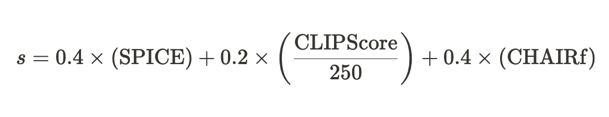
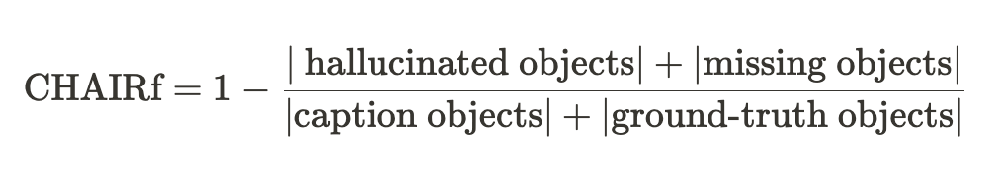

# 👋 Welcome to InThon 2024 Datathon Track! 👋 

# Overview

## 대회명

2024 고려대학교 정보대학 해커톤·데이터톤 InThon 데이터톤 트랙

## 일시

2024년 11월 9일 (토) 12:00 ~ 11월 10일 (일) 18:00

## 진행 장소

고려대학교 우정정보관

## 총 참가자 수

40명 (4인 1조, 10팀)

## 주최

- 고려대학교 정보대학 학생회
- 고려대학교 SW중심대학사업단

## 후원

- [Pebblous](https://pebblous.ai/kr)

## 상금 및 시상 규모

- 대상 (1팀): 300만원 & 해외 연수 프로그램 선발 시 가산점 제공
- 금상 (1팀): 200만원 & 해외 연수 프로그램 선발 시 가산점 제공
- 은상 (1팀): 100만원
- 동상 (1팀) : 70만원

# Description

## 🎉 소개

**2024 고려대학교 정보대학 해커톤·데이터톤 InThon 데이터톤 트랙에 오신 학우 여러분, 진심으로 환영합니다!**

데이터톤은 주어진 데이터셋을 바탕으로 특정한 태스크를 수행하며, 머신러닝과 딥러닝 모델을 훈련하고 평가하는 과정을 직접 체험해 보는 대회입니다. 이 기회를 통해 딥러닝 프레임워크 사용에 대한 숙련도를 높일 뿐만 아니라, 다양한 문제 상황을 해결하며 **AI 기반 문제 해결 능력**을 기르게 되실 것입니다.

올해 InThon에서는 작년의 **제1회 InThon**에서 한 걸음 더 나아가, 단순한 모델 개발을 넘어 **데이터에 대한 사전 분석과 이해**의 중요성, 그리고 **효율적이며 지속 가능한 AI 모델 개발의 필요성**을 체감할 수 있도록 실제 AI 개발 과정에 가까운 문제 상황을 준비했습니다. 

이번 대회의 데이터셋은 학습용 데이터셋과 테스트 데이터셋으로 나누어져 있습니다. 학습용 데이터셋에는 input과 target output이 포함되어 있으며, 테스트 데이터셋은 input만 주어집니다. 여러분은 학습용 데이터를 활용하여 input으로부터 target output을 예측하는 모델을 개발하고, 이를 테스트 데이터셋에 적용해 결과를 제출하게 됩니다.

참고로, 최종적으로 결과를 csv 파일 형식으로 제출해야 합니다. csv 파일의 형식은 **Submission 섹션**이나 **베이스라인 코드**를 확인하여 맞춰주세요!

**결과 제출**은 최대 20회까지 가능하며, 성능 평가가 완료되면 **Leaderboard**에서 본인의 성능과 순위를 확인할 수 있습니다. 최종 순위는 모델 성능과 발표를 바탕으로 결정되며, 상위 4팀에게는 시상이 이루어질 예정입니다.

여러분 모두 이 대회를 통해 유익한 경험을 쌓으시길 바라며, 멋진 성과를 기대하겠습니다! 화이팅입니다! 🔥

## 📌 주제
InThon 데이터톤의 주제 키워드는 **멀티모달**이며, 세부 주제는 **Reliable & Efficient Image Captioning with Vision-Language Models (VLMs)**입니다!  
이번 대회에서는 주어진 **image-caption pair 데이터셋**을 활용해, 정해진 pre-trained VLM 후보 중 하나의 모델을 fine-tuning하여 image captioning을 수행할 수 있는 모델을 개발하게 됩니다.

**하지만, AI 모델 개발 시 성능만큼이나 중요한 요소들이 있습니다.** 예를 들어, 컴퓨팅 자원이나 시간에 제약이 있을 수 있으며, 성능보다도 답변의 정확도가 우선시되는 경우도 존재하죠.

따라서 이번 대회에서는 여러분의 모델이 단순히 captioning을 얼마나 잘하는지뿐만 아니라 두 가지 추가적인 요소를 성능 평가에 반영합니다:

- 모델이 생성한 caption이 실제 이미지에 기반한, **믿을 수 있는 답변**인지 확인하여 **hallucination (환각 현상)** 여부를 평가합니다. (Reliability, 신뢰성)
- 여러분이 fine-tuning에 사용한 **파라미터 수**를 고려해 모델의 **학습 효율성**을 평가하고, 지속 가능한 AI 개발의 가능성을 확인합니다. (Efficiency & Sustainability, 효율성 및 지속 가능성)

대회 종료 전까지 **정확성, 신뢰성, 효율성 및 지속 가능성**을 모두 고려한 image captioning 모델을 개발해 주세요. 여러분만의 독창적인 문제 해결 방법을 기대합니다! 😎

# Submission

본 대회에 참여하는 모든 참가자는 제공된 데이터셋을 활용하여 **이미지로부터 합리적인 캡션을 생성하는 모델**을 구현해야 합니다. 먼저 적절한 모델을 선택하여 학습 데이터셋으로 충분히 훈련한 후, **테스트 데이터셋의 이미지를 기반으로 캡션을 생성**하여 제출하세요.

## 📄 제출 형식
- 제출 파일은 다음 형식의 **csv 파일**이어야 합니다. 구체적인 예시는 **Dataset 섹션**과 **베이스라인 코드**를 참고하세요.
  ```
  Image_ID, generated_caption
  id1, [generated caption with image of id1]
  id2, [generated caption with image of id2]
  ...
  ```
- **최종 제출 마감 후, 발표 자료와 소스 코드 파일**은 [구글 폼 링크](url)를 통해 제출해주세요.


## 📝 파일명 규칙

1. **발표 자료**:  
   - 파일명은 `InThon_데이터톤_팀명.pptx` 또는 `InThon_데이터톤_팀명.pdf` 형식으로 저장
2. **소스 코드**:  
   - 파일명은 `InThon_데이터톤_팀명.ipynb` 형식으로 저장

## 🛠️ 제출 코드 요구사항
- **제출 코드**에는 결과물을 도출하는 **모든 과정**이 포함되어야 합니다.  
- 운영진 측에서 제출된 코드로 점수 재현이 가능해야 하며, 이를 통해 최종 평가가 이루어질 것입니다.

# Dataset


# 🗂️ 데이터셋 개요

본 데이터셋은 **Image Captioning**을 위한 데이터셋으로, 각 샘플은 이미지(url)와 이를 설명하는 캡션(Paragraph)으로 구성되어 있습니다.

## 📊 데이터 시각화 도구

데이터 분석과 처리를 지원하기 위해 Pebblous에서 제공해주신 자료를 바탕으로 제작한 데이터 시각화 도구를 제공합니다. 

자세한 내용은 다음 링크에서 확인해 주세요: [링크](http://34.64.233.80:8501/3D_Data_Explorer)

## 📋 세부 설명

### dataset.csv
- **`Image_ID`**: 각 이미지를 식별하는 고유 ID입니다.
- **`Paragraph`**: 이미지에 대한 캡션으로, 모델이 예측해야 하는 정답(Ground Truth)입니다. (Test set에서는 제공되지 않습니다.)
- **`url`**: 이미지 데이터에 접근할 수 있는 URL입니다.
- **`train`/`val`/`test`**: 각 샘플이 속한 데이터 split을 나타내며, 세 열 중 하나만 True로 표기됩니다.

### inthon_baseline.ipynb
- **베이스라인 코드**: 대회에 활용할 수 있는 참고 코드입니다.

두 파일 모두 카카오톡 채팅방을 통해 제공될 예정입니다.

# Evaluation

## 🏆 평가 항목 및 비율
각 팀의 제출물과 코드, 발표 내용을 기준으로 최대 100점 만점의 점수가 부여됩니다.

- **📊 발표 및 데이터 분석** (20%)
- **📈 모델 성능** (80%)

## 📊 발표 및 데이터 분석 (20%)

발표 및 데이터 분석 점수는 **심사위원 평가**로 부여됩니다. 팀별 발표에는 모델, 학습 과정 및 기법 뿐만 아니라 **데이터 시각화 자료를 기반으로 한 분석 결과**와 **모델 학습에 적용된 데이터 처리 기법 및 그에 따른 성과**가 포함되어야 합니다.
팀에서 구현한 데이터 시각화와 분석이 모델 성능에 어떤 긍정적인 영향을 미쳤는지 구체적이고 이해하기 쉽게 발표 자료에 담아주세요!

## ⚙️ 모델 성능 (80%)

모델 성능 점수는  **Reliability 점수**에 **Efficiency & Sustainability 가중치**를 적용하여 산출되며, 전체 평가의 80%를 차지합니다. Private test set 기준으로 계산되며, Public test set은 점수 계산에 포함되지 않습니다.

### 🔍 Reliability 점수

**Reliability** 점수는 모델이 생성한 캡션의 성능을 평가하는 **SPICE**, **CLIPScore**, **CHAIRf** 세 가지 지표를 사용해 계산됩니다. 구체적인 점수 산출 방식은 아래와 같습니다.



각 지표 설명:

- **🧪 SPICE** ([논문 링크](https://arxiv.org/abs/1607.08822)): 텍스트의 질을 측정하며, 이미지 캡션을 개체, 속성, 관계의 조합으로 분석하여 생성된 캡션과 실제 캡션 간의 유사도를 평가합니다.
- **📷 CLIPScore** ([논문 링크](https://arxiv.org/abs/2104.08718)): 이미지와 캡션 간 일관성을 평가하며, 사전 훈련된 이미지-언어 모델 CLIP의 임베딩을 사용합니다. 참조 캡션 없이도 이미지와 캡션의 일관성을 평가할 수 있습니다.
- **📊 CHAIRf** ([논문 링크](https://arxiv.org/abs/1809.02156)): 생성된 캡션 내 잘못된 객체와 누락된 객체 비율을 계산하여 실제 객체와의 일치도를 평가합니다. Precision과 Recall을 모두 고려한 지표이며, 아래와 같이 계산됩니다.



### ♻️ Efficiency & Sustainability 가중치

**Efficiency & Sustainability**는 **Reliability** 점수에 적용되는 가중치입니다. 모델 학습에 사용된 **파라미터 수**와 **데이터셋 크기**를 기준으로 산정되며, **두 가중치는 각각 적용됩니다.**

#### 가중치 표 📋

| **학습 가능한 파라미터 수**           | **가중치**           |                            | **학습에 사용된 데이터 포인트 수** <br>(data points x epochs) | **가중치**           |
|--------------------------------------|---------------------|----------------------------|-----------------------------------------------------------|---------------------|
| 1200만 개 초과                        | Reliability x 1.000 |                            | 5,000개 초과                                              | Reliability x 1.000 |
| 1000만 개 초과 ~ 1200만 개 이하       | Reliability x 1.002 |                            | 4,000개 초과 ~ 5,000개 이하                               | Reliability x 1.001 |
| 800만 개 초과 ~ 1000만 개 이하        | Reliability x 1.004 |                            | 3,500개 초과 ~ 4,000개 이하                               | Reliability x 1.002 |
| 500만 개 초과 ~ 800만 개 이하         | Reliability x 1.006 |                            | 2,500개 초과 ~ 3,500개 이하                               | Reliability x 1.004 |
| 300만 개 초과 ~ 500만 개 이하     | Reliability x 1.008 |                | 1,500개 초과 ~ 2,500개 이하                          | Reliability x 1.006 |
| 100만 개 초과 ~ 300만 개 이하         | Reliability x 1.010 |                            | 1,000개 초과 ~ 1,500개 이하                               | Reliability x 1.010 |
| 0개 초과 ~ 100만 개 이하              | Reliability x 1.015 |                            | 500개 초과 ~ 1,000개 이하                                 | Reliability x 1.015 |
| 0개 (Training-free)                  | Reliability x 1.020 |                            | 500개 이하                                               | Reliability x 1.020 |

> **💡 NOTE:** 데이터셋 크기 가중치는 학습 데이터의 총 샘플 수에 학습 반복 횟수(epochs)를 곱한 값에 따라 결정됩니다.

## 🏆 Leaderboard 운영

리더보드에는 제출된 결과의 **Reliability** 점수가 표시됩니다. 테스트 데이터는 Public과 Private으로 나뉘며, 최종 평가는 Private 데이터를 기반으로 진행됩니다.

- **Public score**: 전체 테스트 데이터의 50%에 대한 Reliability 점수. 대회 중 리더보드에 표시되며, 최종 점수에는 반영되지 않습니다.
- **Private score**: 나머지 50%의 테스트 데이터로 계산된 Reliability 점수. 대회 종료 후 리더보드에 표시되며 최종 점수에 반영됩니다.

##  🎯 최종 모델 성능 점수 계산
최종 모델 성능 점수를 손쉽게 계산할 수 있도록 다음 웹사이트에서 점수 계산기를 제공합니다.

자세한 내용은 다음 링크에서 확인해 주세요: [링크](http://34.64.233.80:8501)

# Competition Rules


> InThon 운영진은 대회 종료 후 제출된 코드를 바탕으로 철저한 검수 과정을 통해 부정행위가 발생하였는지 파악하고 이에 따라 **수상 취소, 추후 유사 대회 참여 제한** 등의 방식으로 대응하여 공정한 대회가 이루어지도록 최선을 다 할 것입니다.

> **🚨 대회 진행 중 또는 종료 후 아래의 사항에 해당하는 부정행위가 발견될 경우, 해당 팀은 실격 처리됩니다.** 수상 대상 팀일 경우 수상은 취소되며, 해당 상은 차순위 팀에게 주어집니다. 해당 팀의 모든 팀원은 추후 정보대학에서 주최하는 모든 유사 대회 참가가 제한됩니다.

## ❗ Rules

1. 참가자가 제작한 모델의 소스 코드가 **다른 팀의 코드** 혹은 **인터넷, 출판물 등에서 공개된 소스 코드와 매우 유사하여 표절이 의심**될 경우
2. 모델 구현 과정에서 **학습 데이터셋이 아닌 테스트 데이터셋을 학습에 활용**하거나, 운영진이 제공한 **공식 대회 데이터셋이 아닌 다른 데이터셋**을 학습 또는 결과 도출에 사용한 경우 
   (즉, **제공된 데이터셋 외 유사 또는 동일한 데이터셋을 학습, 추론에 절대 사용하지 말아야 합니다.** 제공된 데이터셋만을 활용해 주세요.)
3. **외부 API나 외부 모델을 사용해 결과물을 후처리 (postprocessing)** 한 경우
4. **3번 외의 기타 방법으로 결과물을 후처리 (postprocessing)** 한 경우
5. 대회 종료 후 제출된 소스 코드를 통해 **운영진이 해당 팀의 점수를 재현할 수 없거나**, **소스 코드를 제출하지 않은 경우**  
   (모든 소스 코드는 **Google Colab 상에서 작동 가능해야** 하며, 이를 초과하는 컴퓨팅 자원을 사용하는 경우도 부정행위로 간주합니다.)
6. **최대 제출 횟수(20회)를 초과**하여 결과를 제출한 경우
7. 기타 유사 대회에서 부정행위로 간주될 수 있는 모든 행위가 적발된 경우
8. **지정된 모델 목록 외 다른 모델을 사용**해 결과물을 제출한 경우

### 🔍 사용 가능한 모델 목록 (Huggingface 모델명 기준)

```
Salesforce/blip2-opt-2.7b
Salesforce/blip2-opt-6.7b
Salesforce/blip2-flan-t5-xl
Salesforce/blip2-flan-t5-xxl
Salesforce/instructblip-flan-t5-xl
Salesforce/instructblip-flan-t5-xxl
Salesforce/instructblip-vicuna-7b
Salesforce/instructblip-vicuna-13b
```

### 🔔 제출 안내

최종 결과 제출 종료 후, **모든 팀은 본인들이 구현한 모델 소스 코드 전체를 운영진 측에 제출**해야 하며, 운영진이 검토하여 위 항목 중 하나라도 위반 사항이 적발되면 부정행위 처리됩니다.

# Q&A


대회 진행 중 모든 질의응답은 **InThon 데이터톤 트랙 공식 웹사이트의 Q&A 탭**을 통해서만 진행됩니다: [[링크](https://ku-inthon-datathon.github.io/2024-Inthon-Datathon/qna.html)]

대회 기간 동안 문의 사항이 발생할 경우, 해당 사이트에 유사한 질문이 존재하는지 확인한 뒤 질의해주시길 바랍니다.
